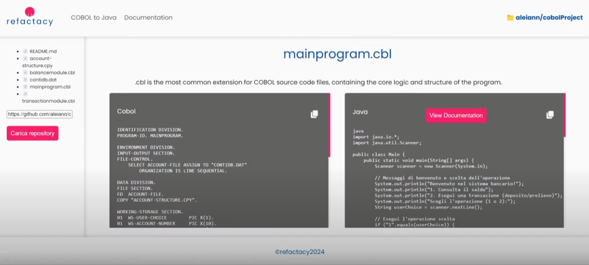
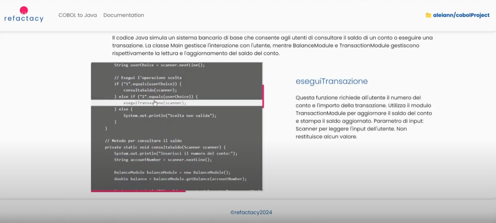

# REFACTACY backend

Di seguito i passaggi per installare il progetto localmente.

### Prerequisiti
- Python (3.8+)

### Istruzioni di installazione
   
1. Creare un ambiente virtuale:
   ```bash 
   # Su Windows
   python -m venv venv
   .\venv\Scripts\activate
   
   #Su MacOS
   python3 -m venv venv
   source venv/bin/activate

2. Installare le dipendenze:
   ```bash
   pip install -r requirements.txt

3. Creare un file .env nella directory principale (Refactacy-backend) ed inserire:
   ```bash
   API_KEY=sk-kleSTW93bSNVqFPto-2YBUC8Ax68q3tgbbTyRgO7shT3BlbkFJdtGvJc_2d6HDWl-sPUqz33r7hBvLc8w89v9AE0zhEA

   
3. Attivare il server locale con Flask:
   ```bash
   #Su Windows
   python main.py

   #Su MacOS
   python3 main.py

4. Output atteso:
   ```bash
   * Running on http://127.0.0.1:5000/ (Press CTRL+C to quit)
   * Restarting with stat
   * Debugger is active!
   
## Esempio di utilizzo

Di seguito alcuni screenshot dimostrativi del prodotto in funzione:





Ecco il link a un video di presentazione: [Link al video!](https://www.youtube.com/watch?v=1Srlgnn9P0w)
